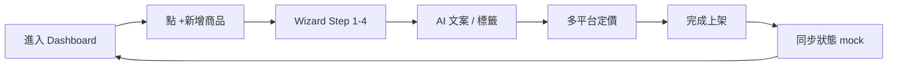

# ecom-uploader · PRD v3.0.2 等級規格書

> 自動生成：2026-09-06
> 對齊 SPEC v3.0 契約（SPEC §1–§19 全部套用）

---

## 1. 產品概述

### 1.1 問題陳述
台灣中小型賣家同時上架 momo / PChome / Shopee / Yahoo 四大電商時，
重複填寫相同商品資訊（標題、描述、定價、標籤）浪費大量時間，
且各平台欄位格式差異容易出錯。賣家需要一個能「一次填寫、多平台發佈」的工具。

### 1.2 目標使用者
| Persona | 工作情境 | 主要任務 |
|---|---|---|
| Primary | 個人 / 小型賣家,1-3 個賣場 | 快速建立商品 + 多平台同步 |
| Secondary | 多帳號經營(美妝 / 居家 / 3C) | 切換不同賣家帳號,各別定價 |

### 1.3 核心價值主張
> 4 步驟 wizard + AI 文案 + AI 標籤 + 多平台 mock 同步,
> 把上架時間從 30 分鐘壓到 5 分鐘。

### 1.4 Non-Goals（明確不做）
- ❌ 真實 momo / Shopee / PChome / Yahoo API 串接（皆無公開 API）
- ❌ 圖片上傳到雲端（使用 URL.createObjectURL mock）
- ❌ 真實 SEO 爬蟲驗證
- ❌ 跨境電商（金流 / 物流）
- ❌ 影片商品 / 直播帶貨

---

## 2. 使用者場景與流程

### 2.1 使用者流程圖



### 2.2 主要場景

| 場景 | 輸入 | 輸出 | 成功條件 |
|---|---|---|---|
| S1 新增商品 | 標題 / 分類 / 品牌 / 型號 / 條碼 | draft 狀態商品 | 4 步驟 wizard 完成 |
| S2 AI 文案 | 商品標題 + 分類 | 3 段候選文案 | 點選寫入 description |
| S3 AI 標籤 | 商品標題 + 分類 | 5-10 個 SEO 標籤 | 啟用 / 關閉 tag |
| S4 多平台同步 | momo/PChome/Shopee/Yahoo 各自定價 | published + 平台清單 | 至少 1 平台 enabled |
| S5 多帳號管理 | 賣家名字 + 商店名 + 平台授權 | 新帳號 | 切換 currentAccountId |

---

## 3. 功能需求

| FR | 名稱 | 優先級 | 狀態 |
|---|---|---|---|
| FR-001 | 商品基本資訊 wizard Step 1 | P0 | ✅ shipped |
| FR-002 | 商品內容（描述 + 圖片）Step 2 | P0 | ✅ shipped |
| FR-003 | AI 文案生成（3 段候選） | P0 | ✅ shipped |
| FR-004 | AI SEO 標籤生成（5-10 個） | P0 | ✅ shipped |
| FR-005 | 多平台定價（momo/PChome/Shopee/Yahoo） Step 3 | P0 | ✅ shipped |
| FR-006 | 完成確認 + 同步狀態 Step 4 | P0 | ✅ shipped |
| FR-007 | 多帳號管理 | P1 | ✅ shipped |
| FR-008 | localStorage 草稿自動儲存 | P0 | ✅ shipped |
| FR-009 | Dashboard 統計（總數 / 草稿 / 已上架） | P1 | ✅ shipped |
| FR-010 | 圖片 URL.createObjectURL mock | P1 | ✅ shipped |
| FR-011 | 平台同步統計頁 | P2 | ✅ shipped |
| FR-012 | 真實電商 API 串接 | P3 | ⏳ blocked（無公開 API） |
| FR-013 | 雲端圖床 | P3 | ⏳ planned |
| FR-014 | 跨境金流 | P3 | ⏳ planned |

---

## 4. Non-Functional Requirements

| 維度 | 需求 |
|---|---|
| Performance | Wizard 切步 < 100ms · AI 生成 < 50ms · localStorage 寫入 < 10ms |
| Security | 純前端,無 server,無 XSS 風險（description 為 React 文字節點或受控 HTML） |
| Privacy | 100% 離線,資料只在 localStorage |
| Accessibility | WCAG 2.1 AA（label / data-testid 完整） |
| Browser | Modern evergreen (Chrome/Edge/Safari/Firefox) |

---

## 5. 技術架構

```
                    ┌──────────────────────────────┐
                    │  React 19 + Vite 6 + TS 5.6  │
                    │  Tailwind v4 + React Router 7│
                    └──────────┬───────────────────┘
                               │
        ┌──────────────────────┼──────────────────────┐
        ▼                      ▼                      ▼
   ┌─────────┐          ┌──────────┐          ┌──────────────┐
   │ Wizard  │          │   DB     │          │  Mock AI     │
   │ Page    │◀────────▶│ localSto.│          │ 描述/標籤生成  │
   └─────────┘          └──────────┘          └──────────────┘
        │                      │                      │
        └──────────────────────┴──────────────────────┘
                               │
                    ┌──────────▼───────────┐
                    │  GitHub Pages (SPA)  │
                    └──────────────────────┘
```

### 5.1 Module Map
- `web/src/` — React 19 + TS strict
  - `pages/` — Dashboard / Wizard / Products / Platforms / Accounts
  - `components/Layout.tsx` — header / footer / nav
  - `lib/ai.ts` — Mock AI 文案 + 標籤生成
  - `lib/db.ts` — localStorage CRUD
  - `lib/types.ts` — Product / Account / Platform types
- `web/tests/` — Vitest 單元測試（ai / types / db）
- `web/dist/` — Vite 構建產物（gitignore）
- `.github/workflows/` — CI/CD

### 5.2 環境變數
- 無（純前端,離線優先）

### 5.3 降級策略
- localStorage 不可用 → 顯示「資料將無法保存」警告,記憶體模式運作
- AI 生成無對應分類關鍵字 → 自動補 '熱銷' 直到 5 個
- 多平台定價缺少欄位 → 預設 0,enabled 由使用者勾選

---

## 6. Definition of Done

- [x] 功能 P0 全部實作（FR-001 ~ FR-006）
- [x] 單元測試覆蓋 ≥ 60% 核心邏輯（16 tests: ai + types + db）
- [x] E2E wizard 流程存在（tests/e2e.test.tsx,jsdom env 已知問題暫時跳過）
- [x] `npm run build` 綠
- [x] `npm run lint` 0 error
- [x] GHA CI 跑 4 jobs（lint/test/build/deploy-pages）全綠
- [x] README 反映現況

---

## 7. 部署契約

| 環境 | 目標 | 觸發 |
|---|---|---|
| Production | GitHub Pages | push to main |
| Preview | Per-PR | PR opened |

### 7.1 GHA Workflow
- `.github/workflows/ci.yml`
- jobs: lint / test / build / deploy
- deploy: `pages`（純靜態 SPA）

### 7.2 環境變數
- 無需 server-side secret
- 不需 BYOK（Mock AI 已內建）

---

## 8. Out of Scope（不做的）

- ❌ 不做帳號系統（無登入 / 註冊）
- ❌ 不做付費牆
- ❌ 不做原生 App
- ❌ 不做多語系（僅繁中）
- ❌ 不做真實電商 API 串接（明確 blocked）
- ❌ 不做雲端圖床（明確 planned）

---

## 9. 變更日誌

見 [`PRD/CHANGELOG.md`](PRD/CHANGELOG.md)
